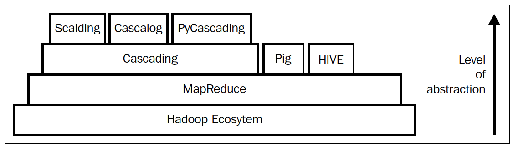
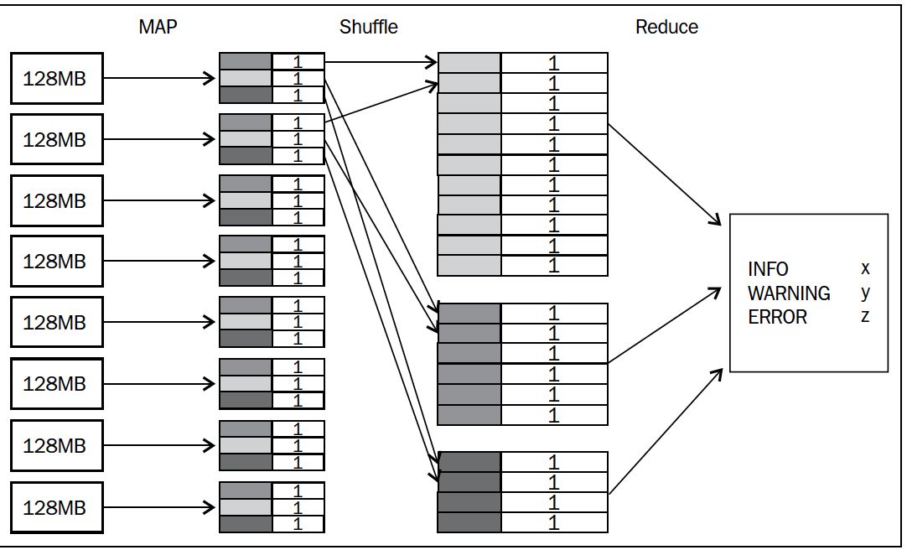
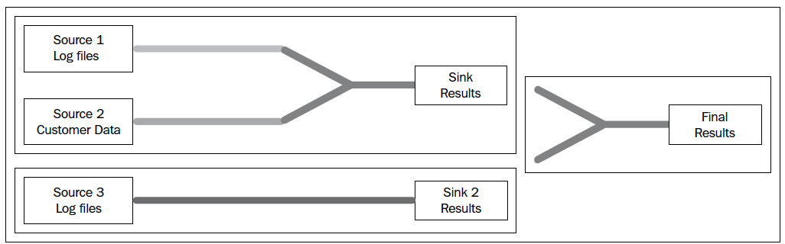
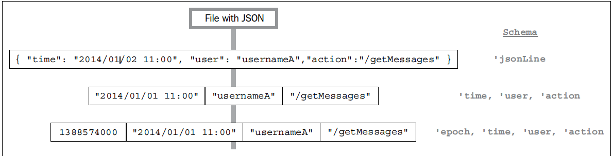

Scalding Tutorial
=================

* [Basics](#basics)
    * [Definition](#definition)
    * [A Real Use-Case?](#a-real-use-case)
    * [Proposing a program methodology](#proposing-a-program-methodology)
    * [Relevance of MapReduce Abstractions](#relevance-of-mapreduce-abstractions)  
    
* [Cascading](#cascading)
    * [Overview](#overview)
    * [Pipe](#pipe) 
    * [Pipe assemblies](#pipe-assemblies)
    * [Cascading extensions](#cascading-extensions)
    
* [Scalding](#scalding)    

Basics
------

### Definition

Scalding is a domain-specific language built on top of the capabilities provided by Cascading. Cascading is an abstraction on MapReduce framework
that empowers us to write efficient MapReduce applications. The API provides a framework for developers who want to think in higher levels and  
follow Behavior Driven Development (BDD) and Test Driven Development (TDD) to provide more value and quality to the business. Scalding is a 
domain-specific language (DSL) that specializes in the particular domain of pipeline execution and further minimizes the amount of code that 
needs to be typed.



### A Real Use-Case

Before we dwell further into the framework and its definition, we will try to understand a real use-case 
and try to evolve ourselves to understand the relevance of Scalding in that context.

Let's say we have a log file of 10 TB in the following format. 

|LOG LEVEL |  MESSAGE                                      |  
|----------|-----------------------------------------------|
|INFO      | MyApp - Entering application.                 |      
|WARNING   | com.foo.Bar - Timeout accessing DB - Retrying |
|ERROR     | com.foo.Bar - Did it again!                   |  
|INFO      | MyApp - Exiting application                   |  

The aim is to use an appropriate programming paradigm to generate the statistics on different types of log messages. 

### Proposing a program methodology

From the very first look on the problem, we have the basic understanding that a sequential processing of the log files is not a feasible option 
and a massive parallel processing methodology will be the most efficient method in this particular context. The most prominent trait of Hadoop 
is that it brings processing to the data; so, MapReduce executes tasks closest to the data as opposed to the data travelling to where the 
processing is performed.
 
Now, we will see how we are solving this problem if we are to use the MapReduce methodology. 
 
MapReduce simplies the complexities of massive parallel processing of large datasets by providing a design pattern that instructs
algorithms to be expressed in ```Map``` and ```Reduce``` phases.
 
- ```Map``` can be used to perfomr simple transformations on data, and ```reduce``` is used to group data together and perform 
  aggregations.
- The ```shared nothing``` architecture of MapReduce prohibits map tasks of the same phase and reduce tasks of the same phase.   
- Simplistic data representation as ```key``` and ```value``` pairs

So, a high level solution approach is shown below:-
  
- Once the file is stored in HDFS, it is split into different blocks of 128 MB and distributed in multiple nodes. 
- Implement a Map class to map lines into ```<key,value>``` pairs; for example, ```<"INFO",1>```
- A Reduce class to aggregate counters
- A Job configuration class to define input and output types for all ```<key,value>``` pairs and the input and output files   



### Relevance of MapReduce Abstractions

If we analyse this particular problem, the MySQL solution can be written as simple as ```SELECT level, count(*) FROM table GROUP BY level```.

If we really go ahead and implement the same logic as a MapReduce program, it will end up with a 50 odd lines of code. Now comes the advantage
of using a framework/abstraction which already takes care of basic necessities for you. We will look into the pros and cons of different of 
different mapreduce abstractions if we were to implement the same problem. 

- **Hive**
    - Pros
        * Seamlessly converts SQL Like commands into sets of MapReduce phases. 
        * Known to everyone and familiar.
        * support extra functionality through loadable user-defined sfunctions (UDF)
    - Cons
        * It is declarative in nature and express the logic without describing its control flow. 
        * There are some problems too complex to be expressed in relational algebra and there are some cases which will be unusual to implement.
          Eg: It will handle joins naturally, but it has not built-in mechanism for splitting data into streams and applying different 
          operations to each sub-stream. 
          
- **Pig**
    - Pros
        * Supports implementation of relational data flow.
        * It is procedural, supports splits, and provides useful operators for joining and grouping data.
        * Code can be inserted anywhere in the data flow and is appealing because it is easy to read and learn.
    - Cons
        * Pig is a purpose-built language; it excels at simple data flows, but it is inefficient for implementing non-trivial algorithms.
- **Cascading** 
    - Pros
        * Implemented in Java and designed to be expressive and extensible. 
        * Based on design pattern of pipeline symbolises chain responsibility design pattern and allows ordered list of actions to be executed. 


Cascading
---------

### Overview

Cascading is an abstraction that empowers us to write efficient MapReduce applications. The API provides a framework for developers who want to 
think in higher levels and follow Behavior Driven Development (BDD) and Test Driven Development (TDD) to provide more value and quality to the 
business.

In Cascading, we define reusable pipes where operations on data are performed. Pipes connect with other pipes to create a pipeline. At each end 
of a pipeline, a tap is used. Two types of taps exist: source, where input data comes from and sink, where the data gets stored.



In the preceding image(on the upper left inner rectangle box), three pipes are connected to a pipeline, and two input sources and one output sink
complete the flow. A complete pipeline is called a flow, and multiple flows bind together to form a cascade. In the diagram, three flows form a 
cascade. The Cascading framework translates the pipes, flows, and cascades into sets of map and reduce phases. The flow and cascade planner 
ensure that no flow or cascade is executed until all its dependencies are satisfied.

### Pipe

Inside a pipe, data flows in small containers called tuples. A tuple is like a fixed size ordered list of elements and is a base element in 
Cascading. Unlike an array or list, a tuple can hold objects with different types. Tuples stream within pipes. Each specific stream is associated
with a schema. The schema evolves over time, as at one point in a pipe, a tuple of size one can receive an operation and transform into a tuple 
of size three.



### Pipe assemblies

Transformation of tuple streams occurs by applying one of the five types of operations, also called pipe assemblies:

- Each: To apply a function or a filter to each tuple
- GroupBy: To create a group of tuples by defining which element to use and to merge pipes that contain tuples with similar schemas
- Every: To perform aggregations (count, sum) and buffer operations to every group of tuples
- CoGroup: To apply SQL type joins, for example, Inner, Outer, Left, or Right joins
- SubAssembly: To chain multiple pipe assemblies into a pipe


To implement the pipe for the logfile example with the INFO, WARNING, and ERROR levels, three assemblies are required: The Each assembly 
generates a tuple with two elements (level/message), the GroupBy assembly is used in the level, and then the Every assembly is applied to 
perform the count aggregation. We also need a source tap to read from a file and a sink tap to store the results in another file. Implementing 
this in Cascading requires 20 lines of code; in Scala/Scalding, the boilerplate is reduced to just the following:

```scala 
TextLine(inputFile)
.mapTo('line->'level,'message) { line:String => tokenize(line) }
.groupBy('level) { _.size }
.write(Tsv(outputFile))
```

Cascading is the framework that provides the notions and abstractions of tuple streams and pipe assemblies. Scalding is a domain-specific 
language (DSL) that specializes in the particular domain of pipeline execution and further minimizes the amount of code that needs to be typed.

### Cascading extensions

Cascading offers multiple extensions that can be used as taps to either read from or write data to, such as SQL, NoSQL, and several other 
distributed technologies that fit nicely with the MapReduce paradigm.

Scalding
--------

Scalding is a domain-specific language (DSL) that specializes in the particular domain of pipeline execution and further minimizes the amount 
of code that needs to be typed.

### Core capabilities of Scalding

- **Map Like Operations**
    - map
    These operations are internally translated into map phases of MapReduce and apply a function to every row of data.
    
    ```scala
     pipe.map(existingFields -> additionalFields) { function }
    ```
    
    - mapTo
    - flatMap
    - flatMapTo
    - unpivot
    - project
    - discard
    - insert
    - limit
    - filter
    - sample
    - pack
    - unpack                           
    
- **Join Operations**
    - joinWithSmaller
    - joinWithLarger
    - joinWithTiny

- **pipe operations**
    - ++ Operator
    - name
    - debug
    - addTrap
    - rename
    
- **grouping / reducing operations**
    - groupBy
    - groupAll

### Operations on Groups

- avg
- count
- min
- max
- sum
- size
- sizeAsStddev
- mkstring
- toList
- sortBy
- head
- last
- take
- takeWhile
- drop 
- sortWithTake
- sortedReverseTake
- pivot
- reducers
- reduce
- foldLeft
- dot
- histogram
- hyperLogLog
- Composite Operations